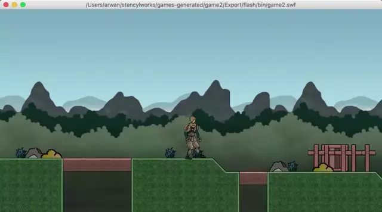
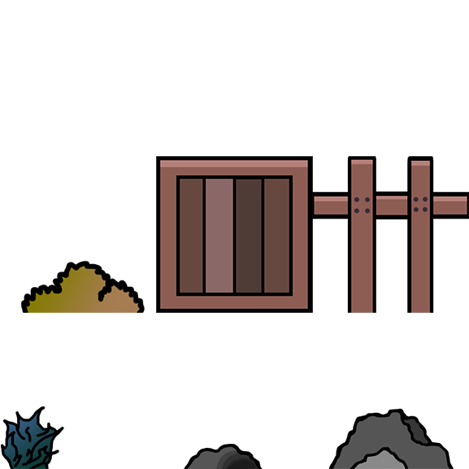
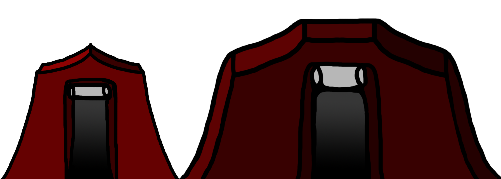
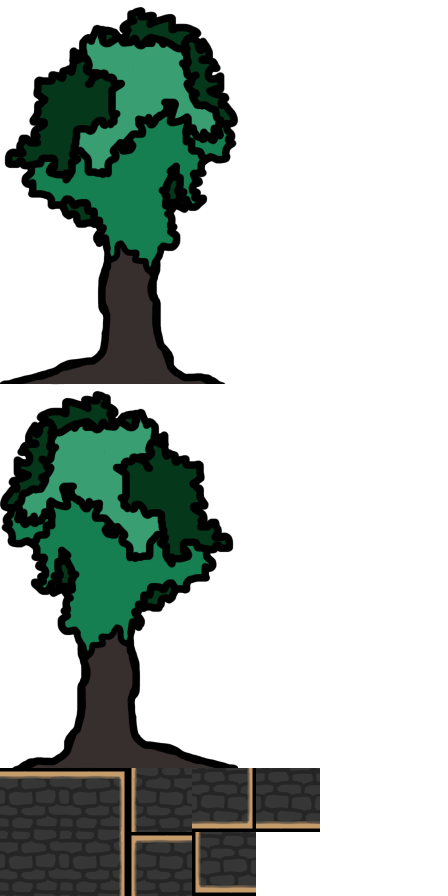
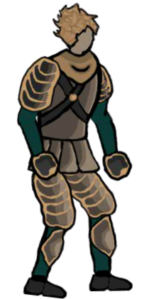
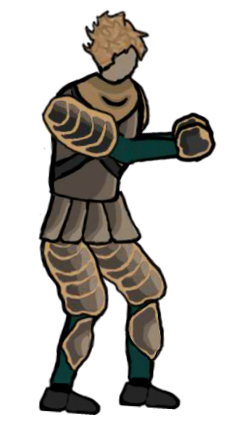
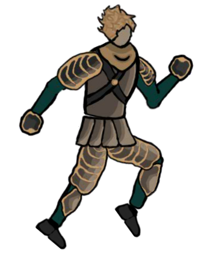
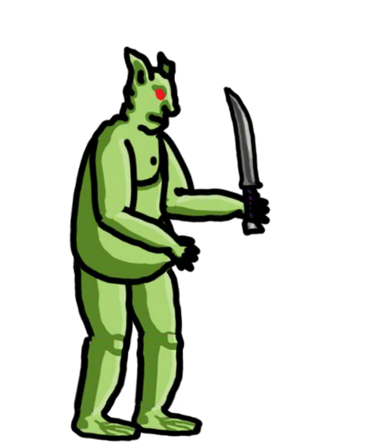
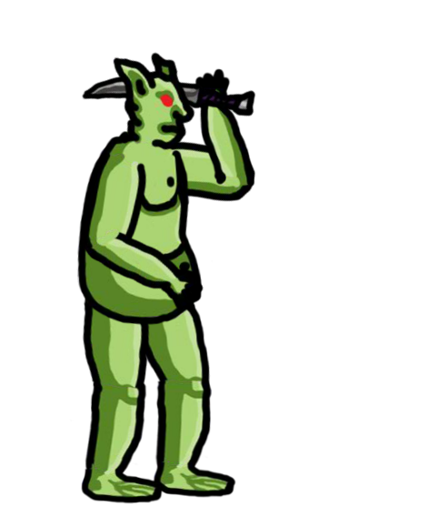
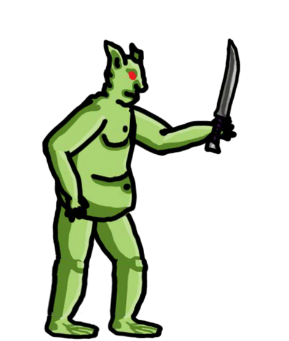

# Cursed-Lands
A 2D action adventure Flash game made with Stencyl

The game style is greatly inspired by Sinjid. The drawings are made in Photoshop and the animations in Animate.

**Map elements**
Element         |           Houses          |         Tiles and Trees
:-------------------------:|:-------------------------:|:------------------------:
 |  | 

**Main Character**
Casting frame 1            |           Casting frame 10          |         Jumping frame 13
:-------------------------:|:-------------------------:|:------------------------:
 |  | 

##Enemy**
Attacking frame 5            |           Attacking frame 14          |         Attacking frame 25
:-------------------------:|:-------------------------:|:------------------------:
 |  | 
